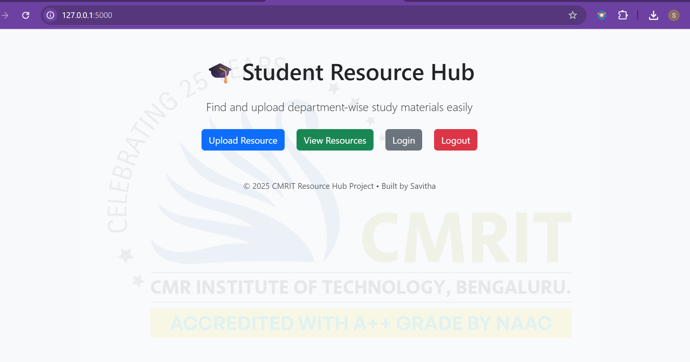

# 🎓 CMRIT Resource Hub

A Flask-based web app that allows students to upload and view department-wise study materials, especially for **module-wise PDFs** (Module 1–5).
---
## 📦 Features

- 🔐 Admin login system
- 📤 Upload up to 5 module PDFs for each subject
- 📁 View all uploaded materials department-wise
- 🖼️ Custom CMRIT logo watermark background
- 📱 Responsive design using Bootstrap
---
## 🛠️ Tech Stack
- Python (Flask)
- SQLite
- HTML + Bootstrap
- CSS (custom + Bootstrap)
- File upload system with Flask backend
---
## 📂 Folder Structure
student-resource-app/
├── app.py
├── static/
│ ├── css/
│ │ └── style.css
│ ├── uploads/
│ │ └── module1_sample.pdf
│ └── cmrit-logo.png
├── templates/
│ ├── index.html
│ ├── upload.html
│ ├── view_resources.html
│ └── login.html
└── database.db (generated at runtime)
---
## 📸 Screenshot

---


---
## 🧪 Demo Credentials
Username: admin
Password: 1234
---
## 📸 Screenshot

---

## 🚀 How to Run Locally

```bash
python app.
Then open:

http://127.0.0.1:5000
```

Developed by Savitha R  
Final year B.E. student, Information Science  
CMR Institute of Technology, Bengaluru


